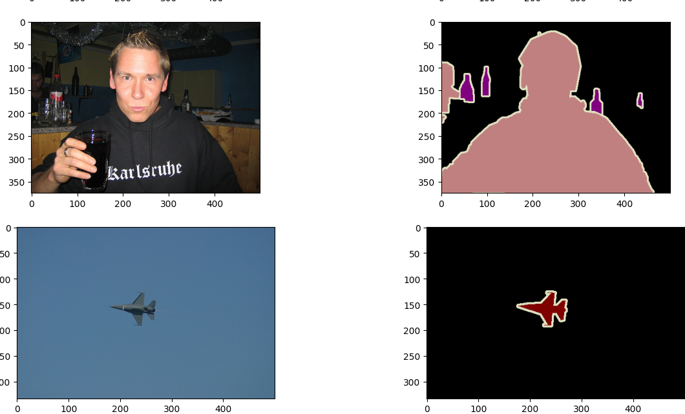
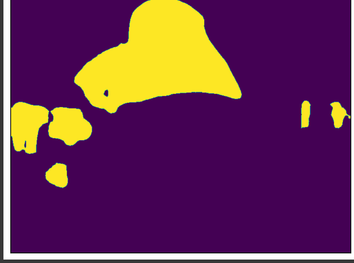
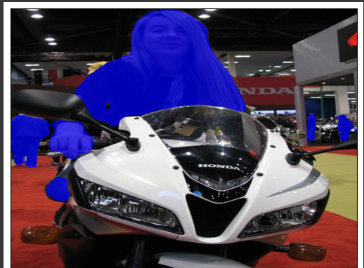

# Mask-RCNN-tutorial---pytorch

## A Mask RCNN tutoral using pytorch for image segmentation on PASCAL VOC dataset `no training required as it will be very expensive anyway` 

# Here is how the dataset look like 

## Image and the mask predicted by the pretrained Model

### Also there is some explanation for ` draw_segmentaion_masks ` from pytorch at the end feel free to take a look

